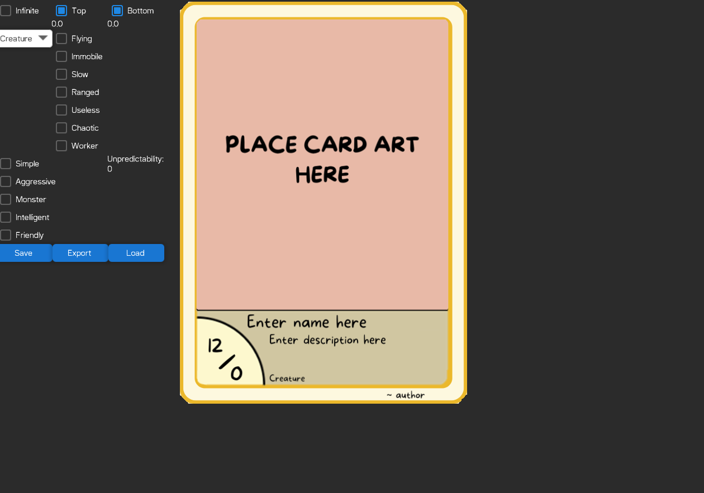

## Card maker for CardWars by [y/BigHoles](https://www.youtube.com/@BigHoles)
[Web Version](http://207.180.202.42:7070/index.html)

## Building
`./gradlew packageJvmFatJar`

you can now find a executable jar file in build/libs/

always use the jar files with the -all suffix

## Usage
- Drag and drop a image file into the center or click on it and select a file
- Set properties
- Edit text fields
- Save
- Export
